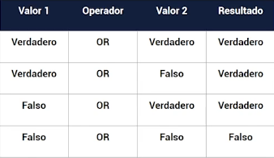

## Inicio

- Para iniciar una aplicacion en **Dart** se utiliza en metodo `main()` sin parametros.

```
void main(){
    print('Hola mundo');
}
```

- Tambien el metodo `main()` puede tener parametros.

```
void main(List<String> args){
    print('Hola mundo');
}
```

## Tipos de datos
- Los tipos de datos en Dart son Objetos
- Valor inicial de los tipos de datos sera null.
    - num
    - int
    - double
    - String
    - bool
    - Lists(Array) => Colecciones
    - Set
    - Maps(Dictionary) => Colecciones
- Conversion de tipos
    - int.parse()
    - double.parse()
    - toString()
    - toInt()
    - toDouble()
- [Data types](../examples/2-basic/1-data-types/main/README.md)

## Variables

- Para crear variables en dart se utiliza el formato CamelCase
- Variable: Espacios en memoria para almacenar un valor
- Las variables tienen que tener nombre significativos
- Una variable no puedo comenzar por numeros
- Una variable no puedo contener espacios y tampoco simbolos especiales
- No deben ser keywords(palabras reservadas)
- Variables sin tipo
    - `var`
- Variable con tipo
    - `int`
    - `double`
    - `String`
    - `bool`
- Variables dinámicas
    - `dynamic`

- [Codigo](../examples/2-basic/2-variables/main/README.md)

#### Numeros

- Los tipos de datos de numero pueden ser
    - ̣̣`num`
    - `int` -> Son valores enteros sin punto decimal -2^63 a 2^63-1
    - `double` -> Numeros de precisión decimal, **Nota:** desde la version 2.1 de Dart permite asignarle un valor `int`

#### Booleanos

- Tipo de datos logico que puede almacenar una condición en ejecución
    - bool

#### Cadenas

- Tipo de datos que puede almacenar texto
    - String
- Interpolacion de cadena se realiza con `$`
- Contatenación de cadenas con `+`
- Saltos de lineas con `'''` con format
- Saltos de linea con \n
- Imprimir todos los simbolos en un string con r
- Escape de caracteres con \

### Constantes

- Constante `final`: Se utiliza cuando este en ejecucion y es ahi donde recien reserva memoria.
- Constante `const`: Se utiliza al iniciar nuestro codigo y ya reserva ese espacio de memoria.
- Características
    - No pude cambiarse
    - Siempre se tiene que inicializarse;

# Operadores

- [https://www.tutorialspoint.com/dart_programming/dart_programming_operators.htm](https://www.tutorialspoint.com/dart_programming/dart_programming_operators.htm)
- [https://medium.com/flutter-community/simple-and-bug-free-code-with-dart-operators-2e81211cecfe](https://medium.com/flutter-community/simple-and-bug-free-code-with-dart-operators-2e81211cecfe
  )

## Operadores Aritmeticos

- En que orden se evaluan las matematicas operaciones complejas
    1. Parentesis
    2. Exponenetes
    3. Multiplicacion/Division
    4. Adición/Sustracción
- Una forma facil de recordar este orden es usando el acronimo PEMDAS
    - Parentesis
    - Exponentes
    - Multiplicación
    - División
    - Adición
    - Sustracción
- Suma `+`
- Resta `-`
- Multiplicación `*`
- División `/`
- Modulo `%` es el restante de una división
- Division de enteros `~/`
- Potencia `**` calcula la potencia de un numero
- [Ejemplo5](../examples/2-basic/ejemplo5/README.md)

## Operadores de comparación

- `==` igualdad
- `!=` No igual o diferente
- `<` menor que
- `>` mayor que
- `<=` menor o igual que
- `>=` mayor o igual que
- [Ejemplo6](../examples/2-basic/ejemplo6/README.md)

## Operadores de Asignación

- `??=` Para asignar sólo si la variable asignada es nula
- `=` asignar valor
- `+=`
- `-=`
- `*=`
- `/=`
- `%=`
- `~/=`

```
// Asigna al valor a variable a
a = value;

// Ejemplo de asignacion
a +=b; // 
a = a + b;
```

- [Ejemplo9](../examples/2-basic/ejemplo9/README.md)

## Operadores Logicos

- `!expresión` Realiza una negación en la expresión


- `&&` AND


- `||` OR


- [Ejemplo7](../examples/2-basic/ejemplo7/README.md)

## Operadores de incremento y decremento

- `++i` Pre incremento
- `i++` Post incremento
- `--i` Pre decremento
- `i--` Post decremento
- [Ejemplo10](../examples/2-basic/ejemplo10/README.md)

## Operador Ternario

- El operador tenerario si lo utilizo en java, php, javascript ya podra utilizarlo en dart ya que se lo utiliza de la
  misma forma.
- `condition ? (statement if true) : (statement if false);`
- [Ejemplo11](../examples/2-basic/ejemplo11/README.md)

## Operadores de prueba de tipo

- Utiles para verificar los tipos en tiempo de ejecución
- `as` Typecast (También utilizado para especificar prefijos de biblioteca)
- `is` Verdadero si el objeto es el tipo especificado
- `is!` Falso si el objeto tiene el tipo especificado
- [Ejemplo8](../examples/2-basic/ejemplo8/README.md)

